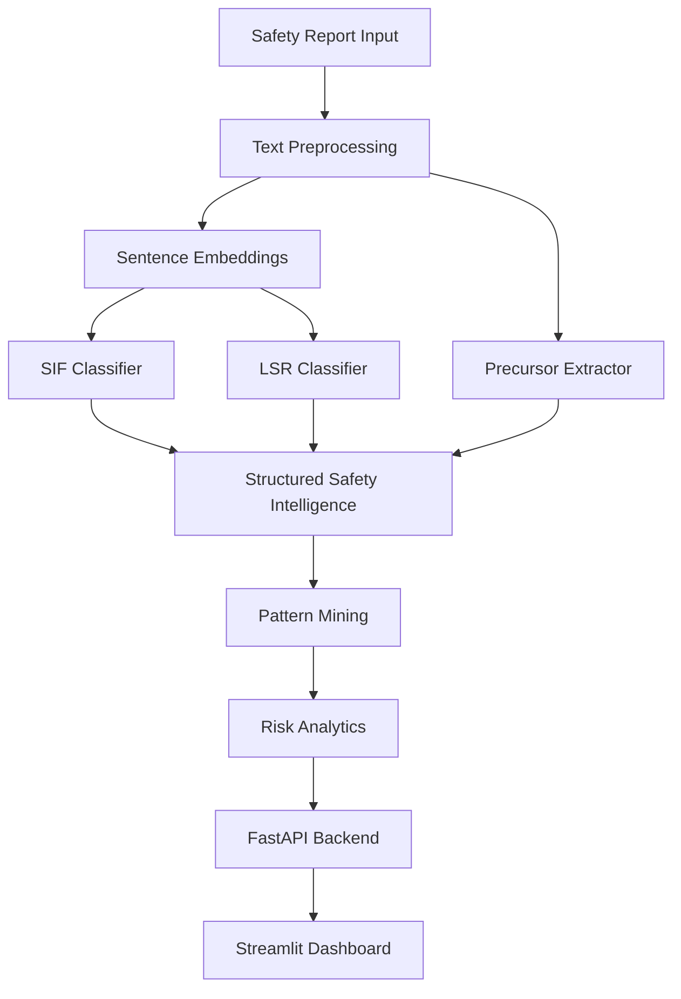

# SIF Precursor Analytics Prototype

This repository contains an end-to-end AI/NLP prototype designed to detect **Serious Injury and Fatality (SIF) precursors** from free-text safety reports (Unsafe Acts, Unsafe Conditions, Near Misses, Incidents). 

> [!CAUTION]
> **This prototype is developed and evaluated primarily using synthetic industrial safety reports. Results must not be interpreted as validated performance on real operational data.**

## 1. Problem Statement
Industrial safety platforms collect large volumes of Unsafe Acts, Unsafe Conditions, Near Misses, and Incident reports. Manual review of these reports may delay the recognition of recurring Serious Injury & Fatality (SIF) precursors. This MVP automatically converts raw, unstructured free-text observations into structured SIF precursor intelligence to serve as a decision-support tool for HSE (Health, Safety, and Environment) professionals.

## 2. Solution Overview
The system reads a short description of a safety observation, infers whether it has SIF potential, predicts the associated Life-Saving Rule (LSR), extracts relevant safety context (equipment, hazards, activities, barrier failures), and surfaces recurring multi-factor risk patterns across the enterprise.

## 3. Architecture


## 4. Core Capabilities
- **SIF Potential Prediction**: Identifies if an event is a SIF-potential precursor using a Sentence Embedding Logistic Regression classifier.
- **Life-Saving Rule (LSR) Classification**: Classifies reports into the primary relevant LSR (e.g. Work at Height, Confined Space) using a One-vs-Rest strategy.
- **Entity Extraction**: Uses hybrid semantic and regex rules to pull Activities, Equipment, Hazards, and Barrier Failures directly from the text.
- **Pattern Mining (FIM)**: Utilizes Frequent Itemset Mining (FP-Growth) to discover combinations of precursors that repeatedly occur together across different sites.
- **Risk Analytics**: Summarizes SIF density by site, highlights top hazards per activity, and flags emerging risk trends.

## 5. Technology Stack
- **Language**: Python 3.10+
- **Machine Learning**: `scikit-learn`, `sentence-transformers` (all-MiniLM-L6-v2)
- **Pattern Mining**: `mlxtend`
- **Backend API**: `FastAPI`, `uvicorn`, `pydantic`
- **Frontend Dashboard**: `Streamlit`, `plotly`, `pandas`

## 6. Repository Structure
- `src/preprocessing/`: Data cleaning and stopword removal.
- `src/models/`: SIF and LSR classifier training and evaluation.
- `src/extraction/`: Hybrid NLP precursor extraction rules.
- `src/analytics/`: Frequent Itemset Mining and data aggregation.
- `src/pipeline/`: Unified inference pipeline merging all AI paths.
- `src/api/`: FastAPI web server and routes.
- `src/dashboard/`: Interactive Streamlit MVP frontend.
- `scripts/`: E2E tests, readiness checks, data generators.
- `data/`: Raw and processed datasets.
- `artifacts/`: Serialized models, analytics JSONs, and evaluation metrics.

## 7. Setup
We recommend using a virtual environment:

```powershell
python -m venv venv
venv\Scripts\Activate.ps1
python -m pip install --upgrade pip
pip install -r requirements.txt
```

To prepare the data and models (assuming `data/synthetic_safety_reports_10k.csv` exists), you can run:
```powershell
python scripts/prepare_demo.py
python -m scripts.check_readiness
```
*(The check_readiness script will output `DEMO_READY = true` if everything is correctly prepared).*

## 8. Running the System
The application is composed of two local servers.

**1. Start the API Server:**
```powershell
uvicorn src.api.main:app --host 0.0.0.0 --port 8000
```
*(The API will be available at `http://localhost:8000`)*

**2. Start the Dashboard:**
Open a new terminal and run:
```powershell
streamlit run src/dashboard/app.py
```
*(The Dashboard will be available at `http://localhost:8501`)*

*(Note: Windows users can simply run `.\scripts\start_demo.ps1` to launch both).*

## 9. API Endpoints
- **Swagger Documentation:** `http://localhost:8000/docs`
- **Predict Single:** `POST /api/v1/predict` - Real-time SIF and LSR inference for a single report.
- **Analytics Summary:** `GET /api/v1/analytics/summary` - Cached top-level KPIs.
- **Analytics Patterns:** `GET /api/v1/analytics/patterns` - Retrieve all mined recurring patterns.

## 10. Dashboard Pages
The Streamlit application contains 10 interactive views:
- **Executive Overview**: High-level KPIs and SIF density.
- **SIF & LSR Analysis**: Breakdown of risks by rule violation and likelihood.
- **Precursor Patterns**: Mined frequent itemsets ranked by Prioritization Score.
- **Site Risk & Activity Analysis**: Hazard drill-downs by location and task.
- **Emerging Trends**: Flagging patterns that are increasing in frequency.
- **Report Explorer**: Tabular interface for raw data with CSV export.
- **Analyse New Report**: Live prediction portal for testing individual free-text entries.
- **System Info**: API Health and Model metadata.

## 11. Evaluation Results
The final architecture (using Sentence Embeddings + Logistic Regression and a Hybrid Rule Extractor) achieved the following validation metrics:

Activity F1          0.879
Equipment Type F1    0.765
Hazard F1            0.854
Barrier Failure F1   0.720
## 12. Limitations
> [!WARNING]
> - **Synthetic Data**: The models were trained purely on synthetic descriptions. There is a high risk of domain shift when applied to real enterprise jargon.
> - **LSR Generalization**: LSR classification relies heavily on explicit semantic markers and generalizes weaker than binary SIF classification.
> - **Extraction Completeness**: The extractor utilizes a curated taxonomy; novel jargon may be missed.
> - **Prototype Prioritization Score**: This metric is an arbitrary combination of frequency and density intended to demonstrate prioritization mechanics. It is **NOT** a validated industrial risk score.
> - **Security**: The current FastAPI application lacks authentication, TLS, and rate limiting required for a production deployment.

## 13. Human-in-the-Loop Requirement
This system is strictly a **decision-support tool**.
It is designed to surface potential SIF precursors, prioritize reports, and highlight recurring patterns.
It **SHOULD NOT** automatically assign disciplinary actions, replace incident investigations, replace HSE expert judgment, or independently trigger operational shutdowns.

## 14. Uploading a New Dataset
The Streamlit dashboard includes a **Data Upload** page that allows you to upload your own raw safety reports directly into the system.

**Required CSV Schema:**
- `description` (The free-text narrative of the safety observation)

**Optional Columns:**
- `report_id`, `date`, `site`, `location`, `report_type`

When you upload a dataset, the MVP processes it entirely locally through the `SafetyInferencePipeline`:
1. Classifies SIF Potential
2. Maps the Life-Saving Rule
3. Extracts Activities, Equipment, Hazards, and Barrier Failures
4. Regenerates all Analytics JSONs
5. Refreshes the Dashboard Cache

*(Note: Processing time depends on the row count. 5,000 rows will take a few minutes. You can revert to the baseline data at any time via the "Restore Original Synthetic Dataset" button on the Data Upload page.)*

## 15. Migration to Real Enterprise Data
To transition this MVP to a real-world enterprise setting, the following plan is required:
1. **Anonymization**: Remove employee names, contractor identifiers, and exact personal identifiers from historical HSSE reports. (Role-based access and encryption will be required).
2. **Annotation**: Engage HSE experts to define SIF labeling guidelines and manually annotate a ground-truth dataset. Ambiguous records require double-review.
3. **Training & Calibration**: Split the data by time/site. Retrain embedding classifiers and calibrate the probability decision thresholds.
4. **Taxonomy Expansion**: Expand the extraction taxonomy to cover site-specific jargon.
5. **Validation**: Validate the prioritization logic with HSE experts and establish a drift monitoring process.
