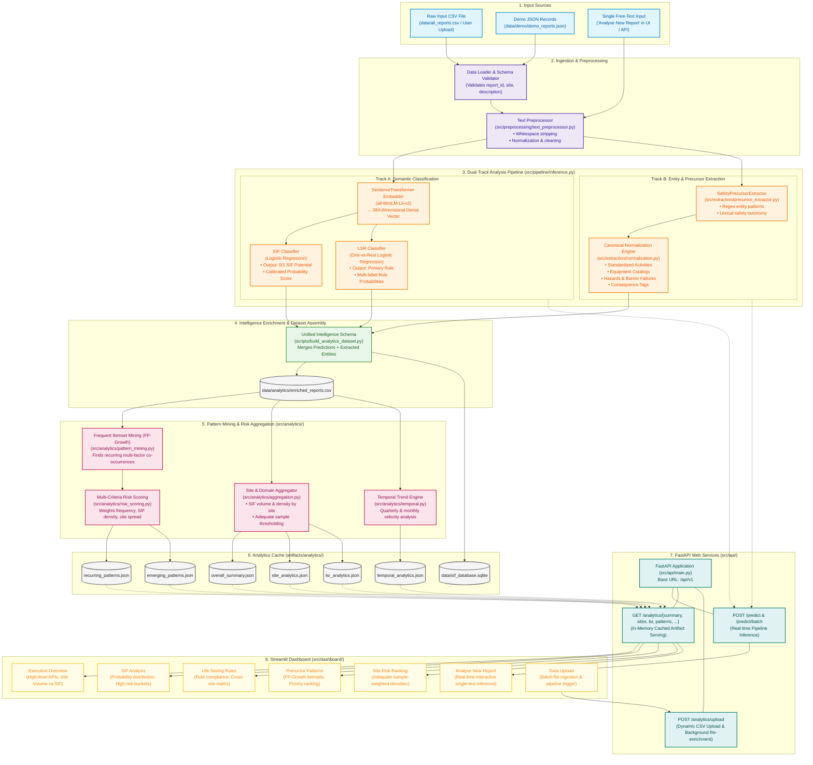

# SIF Precursor Analytics: Workflow & Architecture Documentation

## 1. Executive Summary & Objective

The **Serious Injury and Fatality (SIF) Precursor Analytics Prototype** is an end-to-end AI/NLP system designed to convert unstructured, free-text safety incident and observation reports into structured, actionable safety intelligence. 

Industrial frontline personnel regularly submit thousands of reports categorized as *Unsafe Acts*, *Unsafe Conditions*, *Near Misses*, or *Incidents*. Traditional manual review struggles to scale, resulting in delayed recognition of systemic risk factors. This system automatically:
1. Determines whether an observation exhibits **SIF Potential** and calculates a calibrated probability.
2. Maps observations against enterprise **Life-Saving Rules (LSR)** (e.g., *Work at Height*, *Energy Isolation*, *Confined Space*).
3. Extracts core precursor entities (**Activities**, **Equipment**, **Hazards**, **Barrier Failures**, and **Consequences**).
4. Discovers complex co-occurring risk combinations across multiple operational sites using **Frequent Itemset Mining (FP-Growth)**.
5. Surfaces emerging risk spikes and site-level risk metrics via a **FastAPI backend** and an interactive **Streamlit dashboard**.

---

## 2. Technology Stack

| Domain | Technology / Library | Purpose & Implementation Details |
|---|---|---|
| **Programming Language** | Python 3.10+ | Core language across pipelines, APIs, and frontend. |
| **NLP & Deep Learning** | `sentence-transformers` (`all-MiniLM-L6-v2`) | Generates 384-dimensional dense semantic vector embeddings from free-text descriptions. |
| **Machine Learning** | `scikit-learn`, `numpy`, `pandas` | - Logistic Regression with tuned decision thresholds for binary SIF detection.<br>- One-vs-Rest (OvR) multi-class Logistic Regression for Life-Saving Rules (LSR).<br>- Calibrated probability prediction and model serialization (`pickle`/`joblib`). |
| **Information Extraction** | Custom Hybrid Rule + Taxonomy Engine | Lexical and regex pattern matching combined with domain taxonomy normalization (`src/extraction/normalization.py`). Extracts equipment, activities, hazards, and barrier failures. |
| **Data Mining** | `mlxtend` (FP-Growth) | Unsupervised Frequent Itemset Mining (FIM) to extract recurring precursor combinations across locations without combinatorial explosion. |
| **Backend REST API** | `FastAPI`, `uvicorn`, `pydantic` | Asynchronous REST API providing real-time inference, batch scoring, CSV upload processing, and analytical KPI endpoints. |
| **Frontend UI** | `Streamlit`, `plotly` | High-density HSE operations dashboard with interactive Plotly visualisations, KPI cards, and site risk heatmaps. |
| **Data Persistence** | CSV, JSON, SQLite (`sqlite3`) | - Input raw reports (`data/all_reports.csv`)<br>- Enriched datasets (`data/analytics/enriched_reports.csv`)<br>- Pre-computed analytics JSON artifacts (`artifacts/analytics/*.json`)<br>- Relational observation storage (`data/sif_database.sqlite`) |

---

## 3. End-to-End Data Flow Pipeline

The end-to-end data pipeline is structured into six discrete phases, beginning with the raw input text file:

```
[Raw Input File / Free-Text]
          │
          ▼
[Phase 1: Ingestion & Text Normalization]
          │
          ├──────────────────────────────────────────────┐
          ▼                                              ▼
[Phase 2A: Dense Embedding & ML Models]   [Phase 2B: NLP Precursor Extraction]
  • all-MiniLM-L6-v2 Embeddings (384-d)     • Regex & Keyword Pattern Matchers
  • SIF Logistic Regression Classifier      • Domain Taxonomy Lookup
  • Life-Saving Rule (LSR) Classifier       • Normalization & Canonicalization
          │                                              │
          └──────────────────────┬───────────────────────┘
                                 ▼
              [Phase 3: Structured Safety Intelligence]
                     (Enriched Record / CSV)
                                 │
                                 ▼
              [Phase 4: Advanced Analytics & Pattern Mining]
                • Frequent Itemset Mining (FP-Growth)
                • Multi-Criteria Risk Scoring
                • Site Density & Wilson Interval Filtering
                • Temporal Trend & Spike Detection
                                 │
                                 ▼
              [Phase 5: Storage & Analytics Caching]
                • JSON Artifacts (artifacts/analytics/*.json)
                • SQLite Database (data/sif_database.sqlite)
                                 │
                                 ▼
              [Phase 6: Consumption & Delivery Layer]
                • FastAPI Endpoints (Swagger /docs)
                • Streamlit Operational Web Dashboard
```

---

## 4. Mermaid Flowchart

Below is a detailed Mermaid flowchart illustrating the exact data transformations from the initial input text file to the user-facing interface:



---

## 5. Detailed Component Breakdown

### 5.1 Input Data Ingestion
- **Format Options**:
  - **CSV file** (`data/all_reports.csv` or uploaded via UI) containing structured metadata (`report_id`, `date`, `site`, `location`, `report_type`) along with a free-text `description`.
  - **JSON batch** (`data/demo/demo_reports.json`) containing report objects.
  - **Raw string** via `POST /api/v1/predict` or the Streamlit "Analyse New Report" text area.
- **Example Raw Observation**:
  > *"Technician began opening the pump discharge flange before isolation was verified. Residual pressure remained in the line."*

### 5.2 NLP & Machine Learning Pipeline (`src/pipeline/inference.py`)
When a report passes into `SafetyInferencePipeline`:
1. **Sentence Embeddings**:
   - Model: `sentence-transformers/all-MiniLM-L6-v2`.
   - The free-text string is transformed into a dense 384-dimensional semantic representation capturing conceptual safety semantics (e.g., proximity to high energy, missing safety controls).
2. **SIF Classifier** (`src/models/sif_classifier.py`):
   - A scikit-learn binary Logistic Regression classifier trained on embeddings.
   - Evaluates whether the observation constitutes a precursor to a fatal or life-altering event.
   - Outputs: Binary prediction (`0` or `1`), categorical label (`"SIF-Potential"` vs `"Non-SIF"`), and calibrated probability (e.g., `0.8741`).
3. **Life-Saving Rule (LSR) Classifier** (`src/models/lsr_classifier.py`):
   - A multi-class One-vs-Rest (OvR) Logistic Regression model.
   - Evaluates compliance against standardized industry Life-Saving Rules (e.g., *Energy Isolation*, *Work at Height*, *Line of Fire*, *Hot Work*, *Confined Space*).
   - Outputs: `primary_lsr` alongside confidence scores across all candidate rules.
4. **Precursor Entity Extraction** (`src/extraction/precursor_extractor.py` & `normalization.py`):
   - Employs regex patterns, contextual triggers, and safety taxonomies to extract:
     - **Activity**: `Piping / Valve Maintenance`
     - **Equipment**: `Pump Discharge Flange`
     - **Hazard**: `Residual Pressurized Fluid`
     - **Barrier Failure**: `Isolation Not Verified`
     - **Consequence**: `High Pressure Release / Chemical Spray`
   - Canonical normalization maps diverse phrasing to consistent ontology keys.

### 5.3 Enriched Intelligence Dataset (`data/analytics/enriched_reports.csv`)
The pipeline joins the raw metadata with the model inference results to produce an enriched columnar dataset. This format guarantees that downstream analytics consume consistent, reproducible model outputs without repeatedly invoking transformer inference.

### 5.4 Advanced Analytics & Pattern Mining (`src/analytics/`)
1. **Frequent Itemset Mining (FP-Growth)** (`pattern_mining.py`):
   - Converts multi-dimensional precursors (Activity, Hazard, Equipment, Barrier Failure, LSR) into transactional itemsets.
   - Computes support and confidence to uncover combinations that co-occur across reports.
2. **Composite Risk Scoring** (`risk_scoring.py`):
   - Prioritizes patterns using a weighted objective function:
     $$\text{Priority Score} = w_1 \cdot \text{Frequency} + w_2 \cdot \text{SIF Density} + w_3 \cdot \text{Site Spread} + w_4 \cdot \text{Severity}$$
3. **Site Risk Aggregations** (`aggregation.py`):
   - Computes total report volume, SIF counts, and SIF density per operational facility.
   - Implements adequate sample size filters (e.g., minimum report threshold) to prevent small-sample statistical distortions.
4. **Temporal & Emerging Trend Detection** (`temporal.py`):
   - Calculates moving averages and quarter-over-quarter percentage shifts to detect newly emerging risk patterns before serious incidents materialize.

### 5.5 Backend API (`src/api/`)
- Built with **FastAPI** to provide low-latency REST interfaces.
- **In-Memory Cache**: Loads pre-computed analytics JSON artifacts into memory upon startup for sub-millisecond query responses.
- **Dynamic File Ingestion**: The `/api/v1/analytics/upload` endpoint processes uploaded CSV files asynchronously and recalculates analytics.

### 5.6 Streamlit HSE Dashboard (`src/dashboard/`)
- A modular dashboard communicating with the FastAPI backend through `api_client.py`.
- **Pages**:
  - **Executive Overview**: High-level KPIs, total volume vs. SIF rate, and hazard breakdown.
  - **SIF Analysis**: In-depth SIF distributions, confidence score calibration, and type breakdowns.
  - **Life-Saving Rules**: Cross-site LSR matrix and rule-to-hazard associations.
  - **Precursor Patterns**: Interactive table and cards displaying top recurring FP-Growth patterns and component weights.
  - **Site Risk**: Normalized site risk ranking with adequate sample controls.
  - **Activity Analysis**: Deep dive into specific high-risk operational activities.
  - **Emerging Trends**: Fast-moving hazard combinations flagged with percentage increases.
  - **Analyse New Report**: Live interactive sandbox allowing safety engineers to paste raw text and view instant predictions and extracted entities.
  - **Data Upload**: File dropzone to load new observation datasets into the analytics engine.

---

## 6. Execution Quick-Start Reference

To run the complete pipeline locally:

1. **Activate Environment**:
   ```powershell
   venv\Scripts\Activate.ps1
   ```
2. **Generate / Refresh Analytics (Offline Pipeline)**:
   ```powershell
   python scripts/build_analytics_dataset.py
   python scripts/run_analytics.py
   ```
3. **Start FastAPI Backend**:
   ```powershell
   uvicorn src.api.main:app --host 0.0.0.0 --port 8000
   ```
4. **Start Streamlit Dashboard**:
   ```powershell
   streamlit run src/dashboard/app.py
   ```
   *(Or run `.\scripts\start_demo.ps1` to launch both concurrently)*
